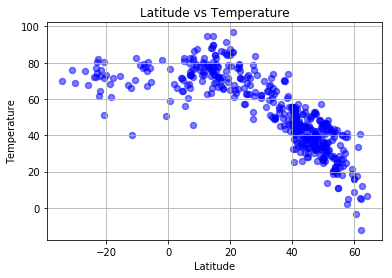
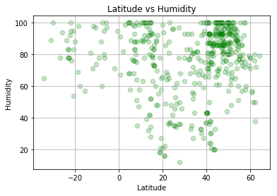
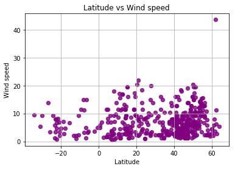

3 observations:

1. The higher the latitude, the more cities are concentrated in the same temperature. For example, majority of the temperatures are concentrated between 20-60 F in the latitudes of 40-60 degrees.
2. The humidity increases with latitude. The most concentrated humidity appears to be in the highest latitudes and highest temperatures.
3. Lowest winds are in the higher altitudes.


```python
# dependencies
import pandas as pd
import numpy as np
import matplotlib.pyplot as plt
import seaborn as sns
from citipy import citipy
from datetime import datetime
import requests
import csv
import time
from time import sleep
import openweathermapy.core as owm
from pprint import pprint
```


```python
# API Google key
from config2 import gkey
```


```python
# API OWM key
from config3 import OWM_key
```


```python
# Import data into a pandas DataFrame
cities_pd = pd.read_csv("worldcities.csv")

# Preview the data
cities_pd.head()
```


<div>
<style scoped>
    .dataframe tbody tr th:only-of-type {
        vertical-align: middle;
    }

    .dataframe tbody tr th {
        vertical-align: top;
    }

    .dataframe thead th {
        text-align: right;
    }
</style>
<table border="1" class="dataframe">
  <thead>
    <tr style="text-align: right;">
      <th></th>
      <th>Country</th>
      <th>City</th>
      <th>Latitude</th>
      <th>Longitude</th>
    </tr>
  </thead>
  <tbody>
    <tr>
      <th>0</th>
      <td>ad</td>
      <td>andorra la vella</td>
      <td>42.500000</td>
      <td>1.516667</td>
    </tr>
    <tr>
      <th>1</th>
      <td>ad</td>
      <td>canillo</td>
      <td>42.566667</td>
      <td>1.600000</td>
    </tr>
    <tr>
      <th>2</th>
      <td>ad</td>
      <td>encamp</td>
      <td>42.533333</td>
      <td>1.583333</td>
    </tr>
    <tr>
      <th>3</th>
      <td>ad</td>
      <td>la massana</td>
      <td>42.550000</td>
      <td>1.516667</td>
    </tr>
    <tr>
      <th>4</th>
      <td>ad</td>
      <td>les escaldes</td>
      <td>42.500000</td>
      <td>1.533333</td>
    </tr>
  </tbody>
</table>
</div>


```python
# select 500 cities
selected_cities = cities_pd.sample(n=500)

selected_cities.head()
```


<div>
<style scoped>
    .dataframe tbody tr th:only-of-type {
        vertical-align: middle;
    }

    .dataframe tbody tr th {
        vertical-align: top;
    }

    .dataframe thead th {
        text-align: right;
    }
</style>
<table border="1" class="dataframe">
  <thead>
    <tr style="text-align: right;">
      <th></th>
      <th>Country</th>
      <th>City</th>
      <th>Latitude</th>
      <th>Longitude</th>
    </tr>
  </thead>
  <tbody>
    <tr>
      <th>13682</th>
      <td>gr</td>
      <td>karousades</td>
      <td>39.780833</td>
      <td>19.741111</td>
    </tr>
    <tr>
      <th>4098</th>
      <td>br</td>
      <td>tangua</td>
      <td>-22.733333</td>
      <td>-42.716667</td>
    </tr>
    <tr>
      <th>24878</th>
      <td>mx</td>
      <td>xico</td>
      <td>19.416667</td>
      <td>-97.000000</td>
    </tr>
    <tr>
      <th>16106</th>
      <td>hu</td>
      <td>tomorkeny</td>
      <td>46.617161</td>
      <td>20.043569</td>
    </tr>
    <tr>
      <th>42737</th>
      <td>us</td>
      <td>somers</td>
      <td>41.985278</td>
      <td>-72.446667</td>
    </tr>
  </tbody>
</table>
</div>


```python
all_cities_details = []

for index, row in selected_cities.iterrows():
    city = citipy.nearest_city(row["Latitude"], row["Longitude"])
    settings = {"units": "imperial", "appid": OWM_key}
    row_counts = 0

#for index, row in all_cities_details.iterrows():
time.sleep(1)
# API calls
base_url = "http://api.openweathermap.org/data/2.5/weather?"
units = "imperial"
url = base_url + "lat=" + str(row["Latitude"]) + "&lon=" + str(row["Longitude"]) + "&appid=" + OWM_key + "&units=" +units
print(url)
    
result = requests.get(url).json()
#print(result)
print("Pulling the city nr " + str(row_counts))
print(url)
row_counts += 1
try:
        data = owm.get_current(f"{city.city_name},{city.country_code}", **settings)
        city_details = {
            "name": city.city_name,
            "lat": data["coord"]["lat"],
            "lon": data["coord"]["lon"],
            "wind": data["wind"]["speed"],
            "temperature": data["main"]["temp"],
            "humidity": data["main"]["humidity"],
            "clouds": data["clouds"]["all"]
        }
        all_cities_details.append(city_details)
except:
    pass
#all_cities_details
```

    http://api.openweathermap.org/data/2.5/weather?lat=49.691666999999995&lon=8.458611&appid=96b0ac2a3e3e0b6a0b172be8179d6152&units=imperial
    Pulling the city nr 0
    http://api.openweathermap.org/data/2.5/weather?lat=49.691666999999995&lon=8.458611&appid=96b0ac2a3e3e0b6a0b172be8179d6152&units=imperial


```python
all_cities_pd = pd.DataFrame(all_cities_details)
all_cities_pd.head()
```


<div>
<style scoped>
    .dataframe tbody tr th:only-of-type {
        vertical-align: middle;
    }

    .dataframe tbody tr th {
        vertical-align: top;
    }

    .dataframe thead th {
        text-align: right;
    }
</style>
<table border="1" class="dataframe">
  <thead>
    <tr style="text-align: right;">
      <th></th>
      <th>clouds</th>
      <th>humidity</th>
      <th>lat</th>
      <th>lon</th>
      <th>name</th>
      <th>temperature</th>
      <th>wind</th>
    </tr>
  </thead>
  <tbody>
    <tr>
      <th>0</th>
      <td>20</td>
      <td>78</td>
      <td>-22.73</td>
      <td>-42.71</td>
      <td>tangua</td>
      <td>81.82</td>
      <td>8.05</td>
    </tr>
    <tr>
      <th>1</th>
      <td>8</td>
      <td>58</td>
      <td>19.42</td>
      <td>-97.01</td>
      <td>xico</td>
      <td>69.26</td>
      <td>3.38</td>
    </tr>
    <tr>
      <th>2</th>
      <td>0</td>
      <td>84</td>
      <td>46.62</td>
      <td>20.04</td>
      <td>tomorkeny</td>
      <td>38.68</td>
      <td>6.93</td>
    </tr>
    <tr>
      <th>3</th>
      <td>90</td>
      <td>24</td>
      <td>41.33</td>
      <td>-73.69</td>
      <td>somers</td>
      <td>42.60</td>
      <td>4.70</td>
    </tr>
    <tr>
      <th>4</th>
      <td>56</td>
      <td>94</td>
      <td>50.19</td>
      <td>27.56</td>
      <td>poninka</td>
      <td>27.45</td>
      <td>6.29</td>
    </tr>
  </tbody>
</table>
</div>


```python
selected_cities.to_csv("worldweather.csv", index=False)
```


```python
# latitude vs temperature
plt.scatter(all_cities_pd["lat"], all_cities_pd["temperature"], alpha=0.5, facecolor="blue", linewidth = 1.4)
plt.title("Latitude vs Temperature")
plt.xlabel("Latitude")
plt.ylabel("Temperature")
plt.savefig("Latvtemp.png")
plt.grid()
plt.show()
```





```python
# latitude vs humidity
plt.scatter(all_cities_pd["lat"], all_cities_pd["humidity"], alpha=0.2, facecolor="green", linewidth = 1.9)
plt.title("Latitude vs Humidity")
plt.xlabel("Latitude")
plt.ylabel("Humidity")
plt.savefig("Latvhumdty.png")
plt.grid()
plt.show()
```





```python
# latitude vs cloudiness
plt.scatter(all_cities_pd["lat"], all_cities_pd["clouds"], alpha=0.7, facecolor="orange", linewidth = 1.9)
plt.title("Latitude vs Cloudiness")
plt.xlabel("Latitude")
plt.ylabel("Cloudiness")
plt.savefig("Latvclouds.png")
plt.grid()
plt.show()
```


```python
# latitude vs wind
plt.scatter(all_cities_pd["lat"], all_cities_pd["wind"], alpha=0.8, facecolor="purple", linewidth = 1.3)
plt.title("Latitude vs Wind speed")
plt.xlabel("Latitude")
plt.ylabel("Wind speed")
plt.savefig("Latvwind.png")
plt.grid()
plt.show()
```




